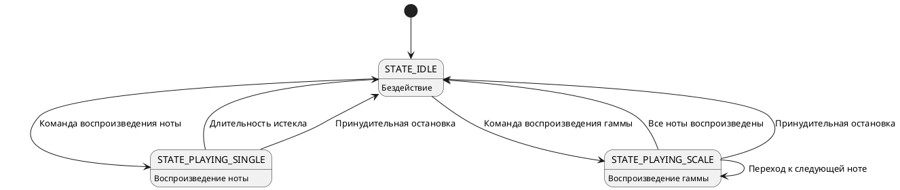

<div align="center">


<h3 style="margin-top: 50px;">Федеральное государственное автономное образовательное учреждение высшего образования</h3>

<h3 style="margin-top: 50px;">Университет ИТМО</h3>

<h3 style="margin-top: 50px;">Проектирование вычислительных систем</h3>
<h3>Лабораторная работа №3</h3>
<h3>"Таймеры"</h3>

<h3 style="margin-top: 50px;">Вариант 1</h3>

<div style="margin-left: 500px; margin-top: 100px; text-align: right">
<h3>Выполнили:</h3>
<h4>Бутвин Михаил Павлович, Группа P3430</h4>
<h4>Хабнер Георгий Евгеньевич, Группа P3431</h4>
</div>

<h3 style="margin-top: 50px;">СПб – 2025</h3>
</div>
<div style="page-break-after: always;"></div>

## Цель работы

Получить навыки работы с таймерами микроконтроллера STM32F427VI для генерации звука и организации неблокирующей логики программы.

## Задание

Реализовать музыкальную клавиатуру с помощью излучателя звука. Программа должна поддерживать:

- 9 октав (от субконтроктавы до пятой октавы)
- 7 нот с базовыми частотами для первой октавы: До=261 Гц, Ре=293 Гц, Ми=329 Гц, Фа=349 Гц, Соль=392 Гц, Ля=440 Гц, Си=493 Гц
- Регулируемую длительность звучания от 0.1 до 5 секунд с шагом 0.1 с
- Управление через UART (57600 бод)
- Частота процессорного ядра: 120 МГц

### Команды управления

| Команда | Действие                                        |
| ------- | ----------------------------------------------- |
| `1-7`   | Воспроизведение ноты (До-Си) текущей октавы     |
| `+`     | Увеличение октавы (макс. 8)                     |
| `-`     | Уменьшение октавы (мин. 0)                      |
| `A`     | Увеличение длительности на 0.1 с (макс. 5 с)    |
| `a`     | Уменьшение длительности на 0.1 с (мин. 0.1 с)   |
| `Enter` | Воспроизведение гаммы (всех нот текущей октавы) |

## Реализация

### Аппаратная конфигурация

**Системная тактовая частота:** 120 МГц

- PLL: (25 MHz HSE / 15) * 144 / 2 = 120 MHz
- APB1: 30 MHz (TIM6: 60 MHz)
- APB2: 60 MHz (TIM1: 120 MHz)

**TIM1 (Advanced Timer)** - генерация ШИМ для излучателя звука

- Режим: PWM
- Prescaler: 899
- Auto-reload: динамически изменяется для каждой ноты
- Канал: CH1 (PE9)
- Duty cycle: 50%

- Частота таймера: 120 МГц / 900 = 133.33 кГц
- Формула: ARR = 133333 / Frequency - 1

**TIM6 (Basic Timer)** - прерывания для системного времени

- Prescaler: 5999 (60 MHz / 6000 = 10 kHz)
- Period: 999 (10 kHz / 1000 = 10 Hz → 100 ms)
- Используется для callback-функций

- Частота обновления: 10 Гц (каждые 100 мс) достаточна для обработки длительности нот с шагом 0.1 с

**USART6** - связь с компьютером

- Скорость: 57600 бод
- Пины: PC6 (TX), PC7 (RX)

**Спецификация таймеров STM32:**


### Программная архитектура

#### Модуль `musical_keyboard.c/h`

Реализует неблокирующий конечный автомат для управления воспроизведением звука:

**Диаграмма состояний:**



**Таблица частот:**
Предрасчитанная таблица ARR-значений для 63 комбинаций (9 октав × 7 нот):

```c
static const uint16_t note_arr_table[9][7];
```

Формула расчета ARR:

```
ARR = Timer_Clock / (PSC + 1) / Frequency - 1
ARR = 120,000,000 / 900 / Frequency - 1
```

**Основные функции:**

- `play_note(note, octave, duration_ms)` - запуск воспроизведения ноты
- `play_scale(octave, duration_ms)` - запуск воспроизведения гаммы
- `musical_keyboard_update()` - обработка состояний (вызывается из main loop)
- `stop_note()` - остановка воспроизведения

#### Модуль `main.c`

Обработка UART-команд и вывод сообщений:

**UART-функции:**

- `uart_send(str)` - передача строки
- `uart_send_int(value)` - передача целого числа
- `uart_send_duration(duration_ms)` - вывод длительности в формате "X.Xs"

Все функции используют только целочисленную арифметику для избежания проблем с float printf.

**Главный цикл:**

```c
while (1) {
    musical_keyboard_update();  // Неблокирующая обработка воспроизведения

    uint8_t c;
    if (HAL_UART_Receive(&huart6, &c, 1, 0) == HAL_OK) {
        process_uart_char(c);  // Обработка команды
    }
}
```

## Тестирование

Создан скрипт `test.py` с 29 автоматическими тестами:

- Воспроизведение всех нот (тесты 1-7)
- Изменение октав в полном диапазоне (тесты 8-14)
- Изменение длительности от 0.1 до 5.0 с (тесты 15-20)
- Воспроизведение гаммы (тест 21)
- Обработка неверных символов (тесты 22-27)
- Последовательности нот и мелодии (тесты 28-29)

Запуск тестов:

```bash
python3 test.py [port]
```

По умолчанию используется порт `/dev/tty.usbserial-101`.

## Выводы

В ходе работы получены навыки:

1. Настройки и использования таймеров STM32 для генерации ШИМ
2. Реализации неблокирующей архитектуры с конечным автоматом
3. Работы с музыкальными частотами и октавами
4. Оптимизации UART-вывода для embedded систем (избегание float printf)
5. Создания комплексных тестовых сценариев

Программа демонстрирует правильную работу таймеров и позволяет воспроизводить музыкальные ноты с различными параметрами.
