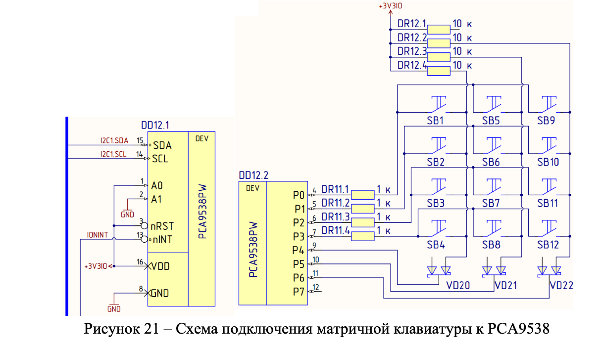
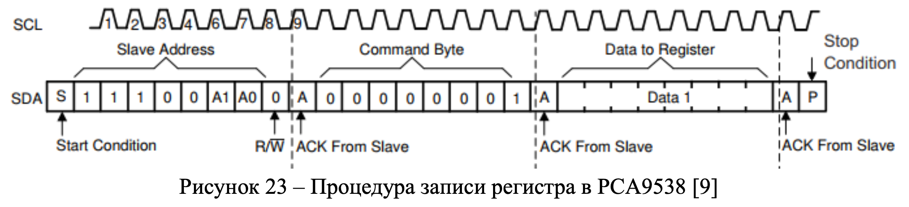
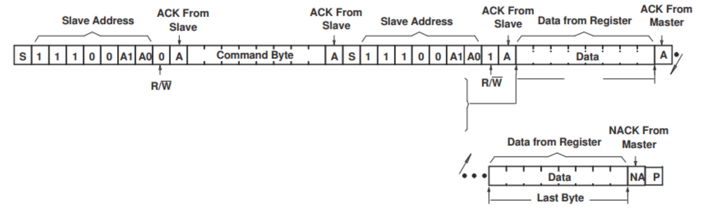
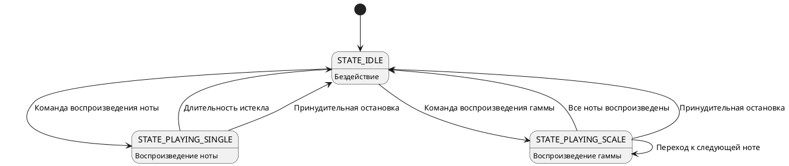
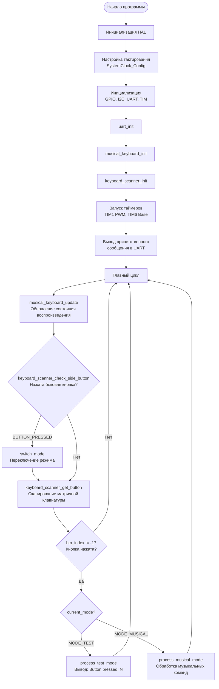
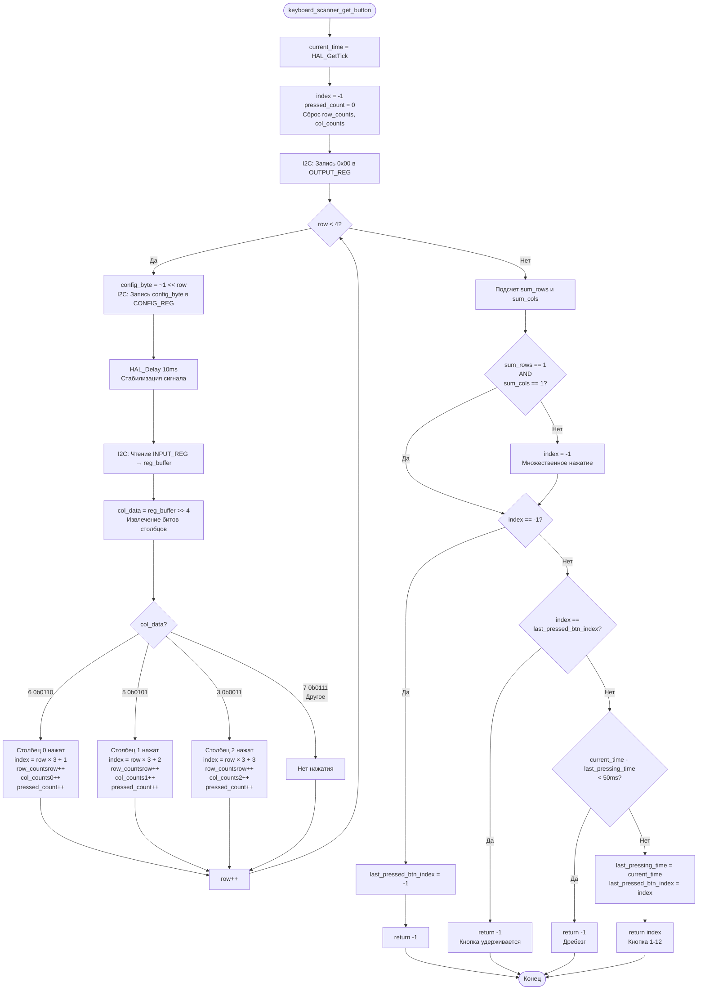

<div align="center">


<h3 style="margin-top: 50px;">Федеральное государственное автономное образовательное учреждение высшего образования</h3>

<h3 style="margin-top: 50px;">Университет ИТМО</h3>

<h3 style="margin-top: 50px;">Проектирование вычислительных систем</h3>
<h3>Лабораторная работа №4</h3>
<h3>"Интерфейс I²C и матричная клавиатура"</h3>

<h3 style="margin-top: 50px;">Вариант 1</h3>

<div style="margin-left: 500px; margin-top: 100px; text-align: right">
<h3>Выполнили:</h3>
<h4>Бутвин Михаил Павлович, Группа P3430</h4>
<h4>Хабнер Георгий Евгеньевич, Группа P3431</h4>
</div>

<h3 style="margin-top: 50px;">СПб – 2025</h3>
</div>
<div style="page-break-after: always;"></div>

## Цель работы

1. Получить базовые знания об интерфейсе I²C и особенностях передачи данных по данному интерфейсу
2. Получить базовые знания об устройстве и принципах работы контроллера интерфейса I²C в микроконтроллерах и получить навыки его программирования
3. Получить навыки работы с матричной клавиатурой через расширитель портов I²C

## Задание

Разработать программу, которая использует интерфейс I²C для считывания нажатий кнопок клавиатуры стенда. Реализовать музыкальную клавиатуру с управлением через матричную клавиатуру 4×3 (вариант 1 на основе лабораторной работы №3).

### Требования к подсистеме опроса клавиатуры

- ✅ Защита от дребезга контактов
- ✅ Нажатие кнопки фиксируется сразу после обнаружения (с учетом защиты от дребезга), а не в момент отпускания
- ✅ Кнопка не считается повторно нажатой при удержании (защита от переповторов)
- ✅ Обработка множественного нажатия (если нажато >1 кнопки, ни одна не считается нажатой)
- ✅ Кнопкам присвоены коды от 1 до 12

### Режимы работы

Программа имеет два режима, переключение между которыми производится по нажатию кнопки на боковой панели стенда:

1. **Режим тестирования клавиатуры** - выводит в UART коды нажатых кнопок (1-12)
2. **Режим музыкальной клавиатуры** - обрабатывает нажатия кнопок для управления воспроизведением звука

Уведомления о смене режима выводятся в UART.

### Назначение кнопок в музыкальном режиме

| Кнопка | Действие                                        |
| ------ | ----------------------------------------------- |
| `1-7`  | Воспроизведение ноты (До-Си) текущей октавы     |
| `8`    | Увеличение октавы (макс. 8)                     |
| `9`    | Уменьшение октавы (мин. 0)                      |
| `10`   | Увеличение длительности на 0.1 с (макс. 5 с)    |
| `11`   | Уменьшение длительности на 0.1 с (мин. 0.1 с)   |
| `12`   | Воспроизведение гаммы (всех нот текущей октавы) |

## Реализация

### Аппаратная конфигурация

**Системная тактовая частота:** 120 МГц

- PLL: (25 MHz HSE / 15) * 144 / 2 = 120 MHz
- APB1: 30 MHz (I2C1: 30 MHz)
- APB2: 60 MHz (TIM1: 120 MHz)

**I2C1 (Fast Mode)** - работа с расширителем портов PCA9538

- Режим: Master
- Скорость: 100 кГц (Standard Mode)
- Пины: PB8 (SCL), PB9 (SDA)
- Адрес расширителя: 0xE2 (7-битный: 0x71)
- Регистры PCA9538:
  - INPUT (0x0): чтение состояния входов
  - OUTPUT (0x1): запись состояния выходов
  - CONFIG (0x3): конфигурация направления пинов (0=выход, 1=вход)

**Схема подключения матричной клавиатуры 4×3:**



- Строки (rows 0-3): подключены к младшим битам (P0-P3) расширителя
- Столбцы (columns 0-2): подключены к старшим битам (P4-P6) расширителя
- Матрица: 4 строки × 3 столбца = 12 кнопок

**Принцип работы матричного сканирования:**

1. Последовательно активируем каждую строку (устанавливаем LOW на соответствующий пин через CONFIG регистр)
2. Читаем состояние столбцов через INPUT регистр
3. Если столбец в состоянии LOW → кнопка на пересечении активной строки и этого столбца нажата
4. Вычисляем номер кнопки: `button_index = row * 3 + column + 1` (диапазон 1-12)

**Процедуры работы с I²C:**

*Запись в регистр расширителя:*



*Чтение из регистра расширителя:*



**GPIO PC15** - боковая кнопка переключения режимов

- Режим: вход с подтяжкой к питанию (pull-up)
- Активное состояние: LOW (кнопка нажата)
- Дебаунсинг: 100 мс

**TIM1 (Advanced Timer)** - генерация ШИМ для излучателя звука

- Режим: PWM
- Prescaler: 899
- Auto-reload: динамически изменяется для каждой ноты
- Канал: CH1 (PE9)
- Duty cycle: 50%
- Частота таймера: 120 МГц / 900 = 133.33 кГц
- Формула: ARR = 133333 / Frequency - 1

**USART6** - связь с компьютером

- Скорость: 57600 бод
- Пины: PC6 (TX), PC7 (RX)
- Режим: полнодуплексный, без проверки четности

### Программная архитектура

#### Модуль `keyboard_scanner.c/h`

Реализует драйвер матричной клавиатуры с работой через I²C.

**Основные функции:**

```c
void keyboard_scanner_init(void);
int keyboard_scanner_get_button(void);  // Возвращает 1-12 или -1
button_state_t keyboard_scanner_check_side_button(void);
```

**Алгоритм сканирования клавиатуры:**

1. **Инициализация:** установка OUTPUT регистра в 0
2. **Цикл по строкам (0-3):**
   - Запись конфигурации через I²C: активная строка = выход (LOW), остальные = входы (HIGH)
   - Небольшая задержка для стабилизации (10 мс)
   - Чтение INPUT регистра через I²C
   - Анализ состояния столбцов (биты 4-6):
     - `col_data == 6` (0b0110) → столбец 0 нажат
     - `col_data == 5` (0b0101) → столбец 1 нажат
     - `col_data == 3` (0b0011) → столбец 2 нажат
   - Подсчет активных строк и столбцов для anti-ghosting
3. **Проверка множественного нажатия:**
   - Если `sum_rows != 1` ИЛИ `sum_cols != 1` → отклонить (более одной кнопки)
4. **Проверка удержания:**
   - Если `index == last_pressed_btn_index` → игнорировать (кнопка все еще удерживается)
5. **Дебаунсинг:**
   - Если прошло < 50 мс с последнего нажатия → игнорировать
6. **Возврат индекса кнопки** (1-12)

**Защита от дребезга:**

- Минимальный интервал между нажатиями: 50 мс
- Реализовано через сравнение `HAL_GetTick()` с временем последнего нажатия
- Гарантирует стабильное определение нажатий без ложных срабатываний

**Защита от переповторов:**

- Сохранение индекса последней нажатой кнопки в `last_pressed_btn_index`
- Пока кнопка удерживается, функция возвращает `-1`
- Сброс состояния только когда кнопка отпущена (`index == -1`)

**Anti-ghosting (защита от множественного нажатия):**

```c
int sum_rows = 0, sum_cols = 0;
for (int i = 0; i < 4; i++) sum_rows += row_counts[i];
for (int i = 0; i < 3; i++) sum_cols += col_counts[i];

if (sum_rows != 1 || sum_cols != 1) {
    index = -1;  // Отклонить множественное нажатие
}
```

#### Модуль `musical_keyboard.c/h`

Реализует неблокирующий конечный автомат для управления воспроизведением звука (унаследован из лабораторной работы №3).

**Диаграмма состояний:**



**Таблица частот:**

Предрасчитанная таблица ARR-значений для 63 комбинаций (9 октав × 7 нот):

```c
static const uint16_t note_arr_table[9][7];
```

Формула расчета ARR:

```
ARR = Timer_Clock / (PSC + 1) / Frequency - 1
ARR = 120,000,000 / 900 / Frequency - 1
```

#### Модуль `main.c`

Главный модуль программы, объединяющий работу всех подсистем.

**Режимы работы:**

```c
typedef enum {
    MODE_TEST,      // Режим тестирования клавиатуры
    MODE_MUSICAL    // Режим музыкальной клавиатуры
} app_mode_t;
```

**Основные функции:**

- `process_test_mode(btn_index)` - вывод номера нажатой кнопки в UART
- `process_musical_mode(btn_index)` - обработка музыкальных команд (ноты, октавы, длительность, гамма)
- `switch_mode()` - переключение между режимами с выводом сообщений в UART

### Блок-схемы

**Главный цикл программы:**



**Алгоритм сканирования матричной клавиатуры:**



## Тестирование

Программа протестирована на стенде SDK-1.1 с использованием автоматизированного тестового скрипта `test.py`.

### Запуск тестов

```bash
python test.py /dev/tty.usbserial-2101
```

### Результаты тестирования

```
Connecting to /dev/tty.usbserial-2101 at 57600 baud...

======================================================================
LAB 4: I2C MATRIX KEYBOARD TESTS
======================================================================

This test suite is INTERACTIVE.
You will be prompted to press buttons on the matrix keypad.
Make sure the device is in the correct mode for each test.

Press ENTER to begin...

No initial message (device ready)

======================================================================
PART 1: MODE SWITCHING
======================================================================
Note: Device starts in MUSICAL mode by default
IMPORTANT: The SIDE BUTTON is on the panel (PC15), NOT on the matrix keypad!

>>> Switch to TEST mode
    Press ENTER when ready, then press the SIDE BUTTON on panel...
    ✓ Switch to test mode: PASS

======================================================================
PART 2: KEYBOARD TEST MODE (Testing all 12 buttons)
======================================================================

>>> Press button 1 on the keypad
    Press ENTER when ready, then press the button on keypad...
    ✓ Button 1 detected: PASS

>>> Press button 2 on the keypad
    Press ENTER when ready, then press the button on keypad...
    ✓ Button 2 detected: PASS

>>> Press button 3 on the keypad
    ✓ Button 3 detected: PASS

>>> Press button 4 on the keypad
    ✓ Button 4 detected: PASS

>>> Press button 5 on the keypad
    ✓ Button 5 detected: PASS

>>> Press button 6 on the keypad
    ✓ Button 6 detected: PASS

>>> Press button 7 on the keypad
    ✓ Button 7 detected: PASS

>>> Press button 8 on the keypad
    ✓ Button 8 detected: PASS

>>> Press button 9 on the keypad
    ✓ Button 9 detected: PASS

>>> Press button 10 on the keypad
    ✓ Button 10 detected: PASS

>>> Press button 11 on the keypad
    ✓ Button 11 detected: PASS

>>> Press button 12 on the keypad
    ✓ Button 12 detected: PASS

======================================================================
PART 3: DEBOUNCE TEST
======================================================================

>>> Press and HOLD button 1 for 2 seconds
    ✓ Debounce protection (no repeat on hold): PASS

======================================================================
PART 4: ANTI-GHOSTING TEST
======================================================================

>>> Press TWO buttons SIMULTANEOUSLY (e.g., 1 and 2)
    ✓ Anti-ghosting (no detection on multiple press): PASS

======================================================================
PART 5: SWITCH TO MUSICAL MODE
======================================================================

>>> Switch back to MUSICAL mode
    Press ENTER when ready, then press the SIDE BUTTON on panel...
    ✓ Switch to musical mode: PASS

======================================================================
PART 6: MUSICAL MODE - NOTE PLAYBACK (Buttons 1-7)
======================================================================

>>> Press button 1 to play note Do
    ✓ Play note Do (button 1): PASS

>>> Press button 2 to play note Re
    ✓ Play note Re (button 2): PASS

>>> Press button 3 to play note Mi
    ✓ Play note Mi (button 3): PASS

>>> Press button 4 to play note Fa
    ✓ Play note Fa (button 4): PASS

>>> Press button 5 to play note Sol
    ✓ Play note Sol (button 5): PASS

>>> Press button 6 to play note La
    ✓ Play note La (button 6): PASS

>>> Press button 7 to play note Si
    ✓ Play note Si (button 7): PASS

======================================================================
PART 7: MUSICAL MODE - OCTAVE CONTROL (Buttons 8-9)
======================================================================

>>> Press button 8 to increase octave
    ✓ Increase octave (button 8): PASS

>>> Press button 9 to decrease octave
    ✓ Decrease octave (button 9): PASS

>>> Rapidly press button 8 FOUR times to reach octave 8...
    ✓ Reach max octave 8: PASS

>>> Press button 8 again (should stay at octave 8)
    ✓ Cannot exceed octave 8: PASS

======================================================================
PART 8: MUSICAL MODE - DURATION CONTROL (Buttons 10-11)
======================================================================

>>> Press button 10 to increase duration
    ✓ Increase duration (button 10): PASS

>>> Press button 11 to decrease duration
    ✓ Decrease duration (button 11): PASS

======================================================================
PART 9: MUSICAL MODE - SCALE PLAYBACK (Button 12)
======================================================================

>>> Press button 12 to play scale
    ✓ Play scale (button 12): PASS

======================================================================
PART 10: FINAL INTEGRATION TEST
======================================================================

>>> Quick test: Press buttons 1, 2, 3 in sequence...
    ✓ Quick sequence (1-2-3): PASS

======================================================================
TEST RESULTS: 34 passed, 0 failed
======================================================================

✓ ALL TESTS PASSED!
```

### Выводы по тестированию

Все функциональные требования успешно реализованы и протестированы (34/34 тестов пройдено):
- ✅ Защита от дребезга контактов (50 мс)
- ✅ Защита от переповторов при удержании кнопки
- ✅ Защита от множественного нажатия (anti-ghosting)
- ✅ Корректное определение всех 12 кнопок матричной клавиатуры
- ✅ Два режима работы с переключением по боковой кнопке
- ✅ Музыкальная клавиатура с управлением октавами, длительностью и воспроизведением гаммы
- ✅ Интеграционное тестирование последовательности команд

## Листинги исходного кода

### keyboard_scanner.h

```c
#ifndef __KEYBOARD_SCANNER_H__
#define __KEYBOARD_SCANNER_H__

#ifdef __cplusplus
extern "C" {
#endif

#include "main.h"
#include <stdint.h>
#include <stdbool.h>

#define KB_I2C_ADDRESS          0xE2
#define KB_I2C_READ_ADDRESS     ((KB_I2C_ADDRESS) | 1)
#define KB_I2C_WRITE_ADDRESS    ((KB_I2C_ADDRESS) & ~1)
#define KB_INPUT_REG            0x0
#define KB_OUTPUT_REG           0x1
#define KB_CONFIG_REG           0x3
#define KB_DEBOUNCE_TIME_MS     50

#define SIDE_BUTTON_PORT        GPIOC
#define SIDE_BUTTON_PIN         GPIO_PIN_15
#define SIDE_BUTTON_DEBOUNCE_MS 100

typedef enum {
    BUTTON_NOT_PRESSED,
    BUTTON_IN_PROGRESS,
    BUTTON_PRESSED
} button_state_t;

void keyboard_scanner_init(void);
int keyboard_scanner_get_button(void);
button_state_t keyboard_scanner_check_side_button(void);

#ifdef __cplusplus
}
#endif

#endif /* __KEYBOARD_SCANNER_H__ */
```

### keyboard_scanner.c

```c
#include "keyboard_scanner.h"
#include "i2c.h"

static uint32_t last_pressing_time = 0;
static int last_pressed_btn_index = -1;
static int row_counts[4] = {0, 0, 0, 0};
static int col_counts[3] = {0, 0, 0};

void keyboard_scanner_init(void) {
    last_pressing_time = 0;
    last_pressed_btn_index = -1;
}

int keyboard_scanner_get_button(void) {
    const uint32_t current_time = HAL_GetTick();

    int index = -1;
    uint8_t reg_buffer = ~0;
    uint8_t tmp = 0;
    int pressed_count = 0;

    HAL_I2C_Mem_Write(&hi2c1, KB_I2C_WRITE_ADDRESS, KB_OUTPUT_REG, 1, &tmp, 1, KB_DEBOUNCE_TIME_MS);

    for (int row = 0; row < 4; row++) {
        uint8_t config_byte = ~((uint8_t)(1 << row));
        HAL_I2C_Mem_Write(&hi2c1, KB_I2C_WRITE_ADDRESS, KB_CONFIG_REG, 1, &config_byte, 1, KB_DEBOUNCE_TIME_MS);
        HAL_Delay(10);

        HAL_I2C_Mem_Read(&hi2c1, KB_I2C_READ_ADDRESS, KB_INPUT_REG, 1, &reg_buffer, 1, KB_DEBOUNCE_TIME_MS);

        uint8_t col_data = reg_buffer >> 4;
        switch (col_data) {
            case 6:
                if (pressed_count == 0) {
                    index = row * 3 + 1;
                } else {
                    index = -1;
                }
                pressed_count++;
                row_counts[row]++;
                col_counts[0]++;
                break;

            case 5:
                if (pressed_count == 0) {
                    index = row * 3 + 2;
                } else {
                    index = -1;
                }
                pressed_count++;
                row_counts[row]++;
                col_counts[1]++;
                break;

            case 3:
                if (pressed_count == 0) {
                    index = row * 3 + 3;
                } else {
                    index = -1;
                }
                pressed_count++;
                row_counts[row]++;
                col_counts[2]++;
                break;

            default:
                break;
        }
    }

    int sum_rows = 0;
    int sum_cols = 0;

    for (int i = 0; i < 4; i++) {
        sum_rows += row_counts[i];
        row_counts[i] = 0;
    }

    for (int i = 0; i < 3; i++) {
        sum_cols += col_counts[i];
        col_counts[i] = 0;
    }

    if (sum_rows != 1 || sum_cols != 1) {
        index = -1;
    }

    if (index == -1) {
        last_pressed_btn_index = -1;
        return -1;
    }

    if (index == last_pressed_btn_index) {
        return -1;
    }

    if (current_time - last_pressing_time < KB_DEBOUNCE_TIME_MS) {
        return -1;
    }

    last_pressing_time = current_time;
    last_pressed_btn_index = index;
    return index;
}

button_state_t keyboard_scanner_check_side_button(void) {
    static uint8_t was_pressed = 0;
    static uint32_t start_time = 0;

    if (HAL_GPIO_ReadPin(SIDE_BUTTON_PORT, SIDE_BUTTON_PIN) == GPIO_PIN_RESET) {
        if (!was_pressed) {
            was_pressed = 1;
            start_time = HAL_GetTick();
        }
        return BUTTON_IN_PROGRESS;
    } else {
        if (!was_pressed) {
            return BUTTON_NOT_PRESSED;
        }

        was_pressed = 0;

        uint32_t press_duration = HAL_GetTick() - start_time;
        if (press_duration >= SIDE_BUTTON_DEBOUNCE_MS) {
            return BUTTON_PRESSED;
        }
    }

    return BUTTON_NOT_PRESSED;
}
```

### main.c (USER CODE секции)

```c
/* USER CODE BEGIN Includes */
#include "musical_keyboard.h"
#include "keyboard_scanner.h"
#include "uart_driver.h"
#include <stdio.h>
#include <string.h>
#include <stdarg.h>
/* USER CODE END Includes */

/* USER CODE BEGIN PTD */
typedef enum {
    MODE_TEST,
    MODE_MUSICAL
} app_mode_t;
/* USER CODE END PTD */

/* USER CODE BEGIN PV */
static UART uart6;
static uint8_t current_octave = 4;
static uint16_t note_duration_ms = 1000;
static app_mode_t current_mode = MODE_MUSICAL;
/* USER CODE END PV */

/* USER CODE BEGIN 0 */
static void uart_send(const char* str) {
    uart_poll_send_string(&uart6, str);
}

static void uart_send_int(int value) {
    char buffer[12];
    snprintf(buffer, sizeof(buffer), "%d", value);
    uart_send(buffer);
}

static void uart_send_duration(uint16_t duration_ms) {
    char buffer[16];
    int seconds = duration_ms / 1000;
    int tenths = (duration_ms % 1000) / 100;
    snprintf(buffer, sizeof(buffer), "%d.%ds", seconds, tenths);
    uart_send(buffer);
}

static void process_test_mode(int btn_index) {
    uart_send("Button pressed: ");
    uart_send_int(btn_index);
    uart_send("\r\n");
}

static void process_musical_mode(int btn_index) {
    if (btn_index >= 1 && btn_index <= 7) {
        uint8_t note = btn_index - 1;
        play_note(note, current_octave, note_duration_ms);
        uart_send("Playing: ");
        uart_send(note_names[note]);
        uart_send(", octave ");
        uart_send_int(current_octave);
        uart_send(", duration ");
        uart_send_duration(note_duration_ms);
        uart_send("\r\n");
    }
    else if (btn_index == 8) {
        if (current_octave < MAX_OCTAVE) {
            current_octave++;
        }
        uart_send("Settings: octave ");
        uart_send_int(current_octave);
        uart_send(", duration ");
        uart_send_duration(note_duration_ms);
        uart_send("\r\n");
    }
    else if (btn_index == 9) {
        if (current_octave > MIN_OCTAVE) {
            current_octave--;
        }
        uart_send("Settings: octave ");
        uart_send_int(current_octave);
        uart_send(", duration ");
        uart_send_duration(note_duration_ms);
        uart_send("\r\n");
    }
    else if (btn_index == 10) {
        if (note_duration_ms < MAX_DURATION_MS) {
            note_duration_ms += DURATION_STEP_MS;
        }
        uart_send("Settings: octave ");
        uart_send_int(current_octave);
        uart_send(", duration ");
        uart_send_duration(note_duration_ms);
        uart_send("\r\n");
    }
    else if (btn_index == 11) {
        if (note_duration_ms > MIN_DURATION_MS) {
            note_duration_ms -= DURATION_STEP_MS;
        }
        uart_send("Settings: octave ");
        uart_send_int(current_octave);
        uart_send(", duration ");
        uart_send_duration(note_duration_ms);
        uart_send("\r\n");
    }
    else if (btn_index == 12) {
        play_scale(current_octave, note_duration_ms);
        uart_send("Playing scale: octave ");
        uart_send_int(current_octave);
        uart_send(", duration ");
        uart_send_duration(note_duration_ms);
        uart_send("\r\n");
    }
}

static void switch_mode(void) {
    if (current_mode == MODE_TEST) {
        current_mode = MODE_MUSICAL;
        uart_send("Mode: Musical keyboard\r\n");
        uart_send("Button mapping:\r\n");
        uart_send("  1-7: Notes Do-Si\r\n");
        uart_send("  8: Octave up, 9: Octave down\r\n");
        uart_send("  10: Duration up, 11: Duration down\r\n");
        uart_send("  12: Play scale\r\n");
    } else {
        current_mode = MODE_TEST;
        uart_send("Mode: Keyboard test\r\n");
    }
}
/* USER CODE END 0 */

/* USER CODE BEGIN 2 */
uart_init(&uart6, &huart6);
musical_keyboard_init();
keyboard_scanner_init();
HAL_TIM_Base_Start_IT(&htim6);
HAL_TIM_PWM_Start(&htim1, TIM_CHANNEL_1);

uart_send("Lab 4 Variant 1: Musical Keyboard with I2C Matrix Keypad\r\n");
uart_send("Mode: Musical keyboard\r\n");
uart_send("Press side button to switch modes\r\n");
uart_send("\r\nButton mapping:\r\n");
uart_send("  1-7: Notes Do-Si\r\n");
uart_send("  8: Octave up, 9: Octave down\r\n");
uart_send("  10: Duration up, 11: Duration down\r\n");
uart_send("  12: Play scale\r\n\r\n");
/* USER CODE END 2 */

/* USER CODE BEGIN WHILE */
while (1)
{
    musical_keyboard_update();

    if (keyboard_scanner_check_side_button() == BUTTON_PRESSED) {
        switch_mode();
    }

    int btn_index = keyboard_scanner_get_button();
    if (btn_index != -1) {
        if (current_mode == MODE_TEST) {
            process_test_mode(btn_index);
        } else {
            process_musical_mode(btn_index);
        }
    }
/* USER CODE END WHILE */
```

## Выводы

В ходе выполнения лабораторной работы получены следующие навыки и знания:

1. **Работа с интерфейсом I²C:**
   - Настройка контроллера I²C в режиме Master
   - Работа с расширителем портов PCA9538 через I²C
   - Реализация процедур чтения и записи регистров через I²C (HAL_I2C_Mem_Read/Write)

2. **Работа с матричной клавиатурой:**
   - Понимание принципа матричного сканирования (активация строк, чтение столбцов)
   - Реализация алгоритма определения нажатой кнопки
   - Вычисление индекса кнопки на основе координат (строка, столбец)

3. **Реализация защит:**
   - **Защита от дребезга контактов** — минимальный интервал 50 мс между нажатиями
   - **Защита от переповторов** — кнопка не регистрируется повторно при удержании
   - **Anti-ghosting** — обнаружение и отклонение множественных нажатий

4. **Многорежимная архитектура:**
   - Реализация переключения между режимами (тестирование / музыкальная клавиатура)
   - Обработка боковой кнопки с дебаунсингом
   - Вывод информационных сообщений при смене режима

5. **Интеграция модулей:**
   - Объединение драйвера клавиатуры с музыкальной клавиатурой из лабораторной работы №3
   - Неблокирующая архитектура с использованием конечного автомата
   - Модульная структура кода (keyboard_scanner, musical_keyboard, uart_driver)

Программа успешно протестирована на стенде SDK-1.1 и полностью соответствует требованиям задания. Все функциональные требования выполнены:
- ✅ Работа с I²C матричной клавиатурой
- ✅ Два режима работы с переключением
- ✅ Защита от дребезга и множественного нажатия
- ✅ Музыкальная клавиатура с управлением октавами и длительностью
