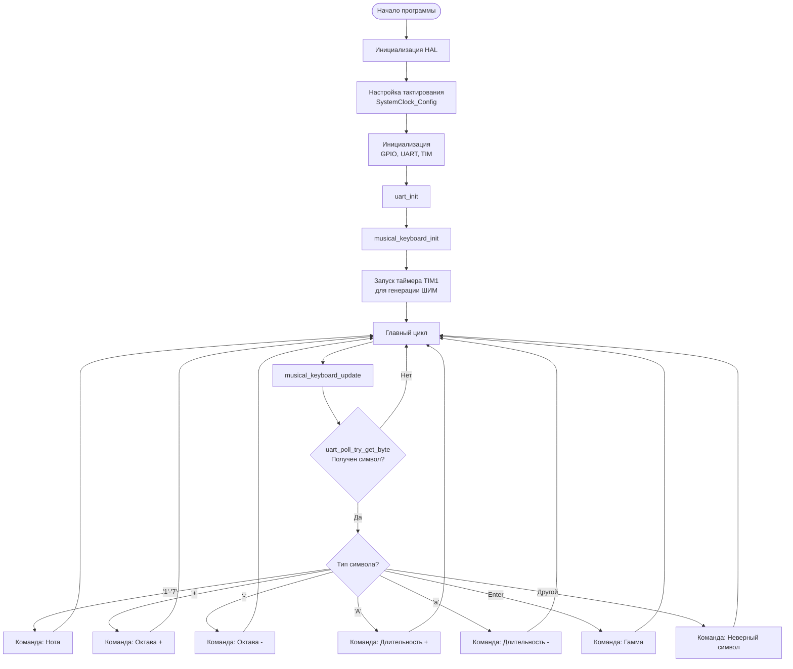
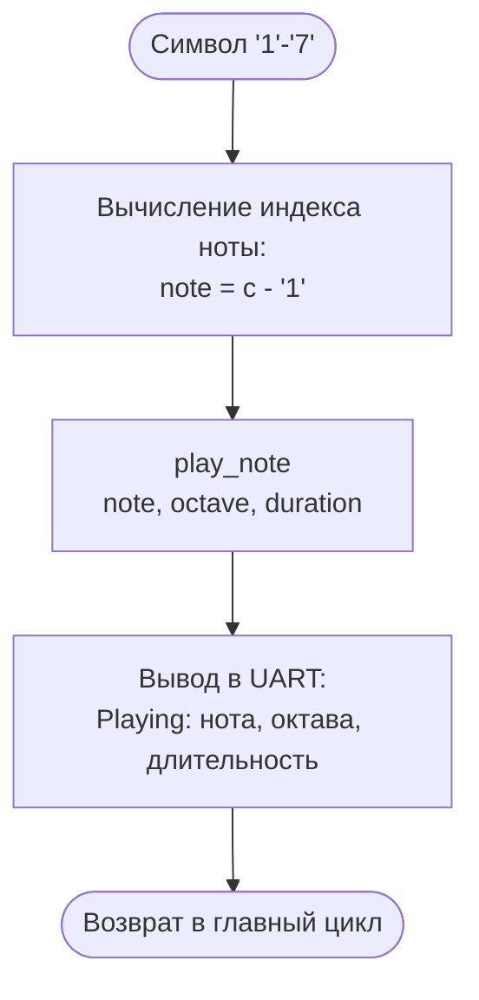
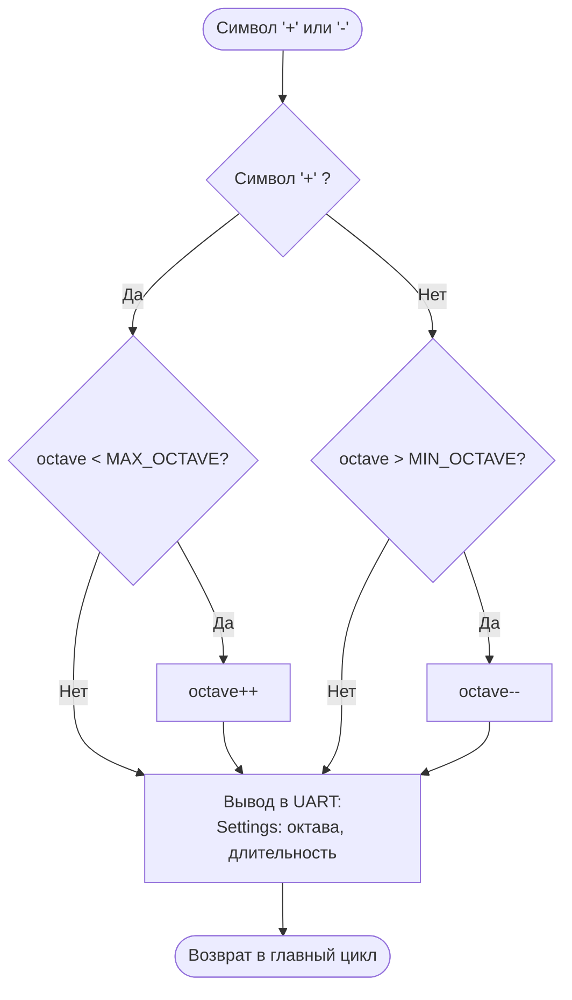
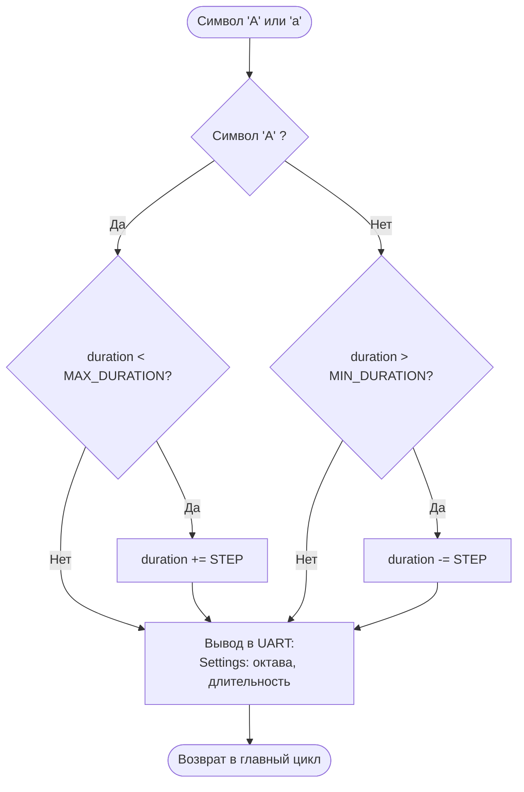
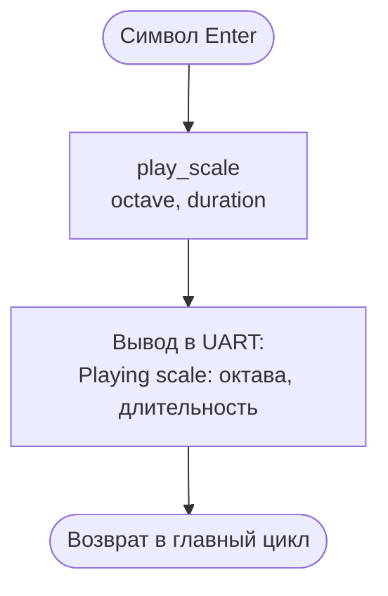
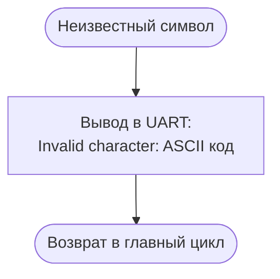

<div align="center">


<h3 style="margin-top: 50px;">Федеральное государственное автономное образовательное учреждение высшего образования</h3>

<h3 style="margin-top: 50px;">Университет ИТМО</h3>

<h3 style="margin-top: 50px;">Проектирование вычислительных систем</h3>
<h3>Лабораторная работа №3</h3>
<h3>"Таймеры"</h3>

<h3 style="margin-top: 50px;">Вариант 1</h3>

<div style="margin-left: 500px; margin-top: 100px; text-align: right">
<h3>Выполнили:</h3>
<h4>Бутвин Михаил Павлович, Группа P3430</h4>
<h4>Хабнер Георгий Евгеньевич, Группа P3431</h4>
</div>

<h3 style="margin-top: 50px;">СПб – 2025</h3>
</div>
<div style="page-break-after: always;"></div>

## Цель работы

1. Получить базовые знания об устройстве и режимах работы таймеров в микроконтроллерах
2. Получить навыки использования таймеров и прерываний от таймеров
3. Получить навыки использования аппаратных каналов ввода-вывода таймеров

## Задание

Реализовать музыкальную клавиатуру с помощью излучателя звука. Программа должна поддерживать:

- 9 октав (от субконтроктавы до пятой октавы)
- 7 нот с базовыми частотами для первой октавы: До=261 Гц, Ре=293 Гц, Ми=329 Гц, Фа=349 Гц, Соль=392 Гц, Ля=440 Гц, Си=493 Гц
- Регулируемую длительность звучания от 0.1 до 5 секунд с шагом 0.1 с
- Управление через UART (57600 бод)
- Частота процессорного ядра: 120 МГц

### Команды управления

| Команда | Действие                                        |
| ------- | ----------------------------------------------- |
| `1-7`   | Воспроизведение ноты (До-Си) текущей октавы     |
| `+`     | Увеличение октавы (макс. 8)                     |
| `-`     | Уменьшение октавы (мин. 0)                      |
| `A`     | Увеличение длительности на 0.1 с (макс. 5 с)    |
| `a`     | Уменьшение длительности на 0.1 с (мин. 0.1 с)   |
| `Enter` | Воспроизведение гаммы (всех нот текущей октавы) |

## Реализация

### Аппаратная конфигурация

**Системная тактовая частота:** 120 МГц

- PLL: (25 MHz HSE / 15) * 144 / 2 = 120 MHz
- APB1: 30 MHz
- APB2: 60 MHz (TIM1: 120 MHz)

**TIM1 (Advanced Timer)** - генерация ШИМ для излучателя звука

- Режим: PWM
- Prescaler: 899
- Auto-reload: динамически изменяется для каждой ноты
- Канал: CH1 (PE9)
- Duty cycle: 50%

- Частота таймера: 120 МГц / 900 = 133.33 кГц
- Формула: ARR = 133333 / Frequency - 1

**Принцип генерации звука:**

TIM1 работает в режиме PWM (широтно-импульсной модуляции) и генерирует сигнал на выходе CH1 (пин PE9), который напрямую подключен к пьезоизлучателю звука на плате.

Частота звука определяется периодом ШИМ-сигнала, который зависит от значения регистра ARR (Auto-Reload Register):

```
Частота_звука = Timer_Clock / (ARR + 1)
Частота_звука = 133333 Гц / (ARR + 1)
```

**Управление частотой в коде:**

Для изменения частоты звучания программа динамически записывает новое значение в регистр ARR:

```c
static void set_buzzer_frequency(uint16_t arr_value) {
    htim1.Instance->ARR = arr_value;      // Устанавливаем период (частоту)
    htim1.Instance->CCR1 = arr_value / 2; // Duty cycle 50% (половину периода высокий уровень, половину - низкий)
}
```

Например, для ноты До первой октавы (261 Гц):
- ARR = 133333 / 261 - 1 = 510
- Программа записывает 510 в регистр TIM1->ARR
- Таймер начинает генерировать меандр с частотой 133333 / 511 ≈ 261 Гц
- Этот сигнал поступает на излучатель, который вибрирует с частотой 261 Гц, создавая звук

**Отсчет времени:**

Для неблокирующего отсчета длительности нот используется системный таймер **SysTick** через функцию `HAL_GetTick()`:
- Функция `musical_keyboard_update()` вызывается в главном цикле
- Сравнивает текущее время с временем начала воспроизведения
- Останавливает ноту при истечении заданной длительности

```c
void musical_keyboard_update(void) {
    uint32_t current_time = HAL_GetTick();  // SysTick, 1 мс разрешение
    if (current_time - play_start_time >= play_duration_ms) {
        stop_note();
    }
}
```

**USART6** - связь с компьютером

- Скорость: 57600 бод
- Пины: PC6 (TX), PC7 (RX)

**Спецификация таймеров STM32:**


### Программная архитектура

#### Модуль `musical_keyboard.c/h`

Реализует неблокирующий конечный автомат для управления воспроизведением звука:

**Диаграмма состояний:**


**Блок-схема основного алгоритма:**

*Главный цикл программы:*



*Обработка команды воспроизведения ноты ('1'-'7'):*



*Обработка команд изменения октавы ('+'/'-'):*



*Обработка команд изменения длительности ('A'/'a'):*



*Обработка команды воспроизведения гаммы (Enter):*



*Обработка неверного символа:*



**Таблица частот:**
Предрасчитанная таблица ARR-значений для 63 комбинаций (9 октав × 7 нот):

```c
static const uint16_t note_arr_table[9][7];
```

Формула расчета ARR:

```
ARR = Timer_Clock / (PSC + 1) / Frequency - 1
ARR = 120,000,000 / 900 / Frequency - 1
```

**Основные функции:**

- `play_note(note, octave, duration_ms)` - запуск воспроизведения ноты
- `play_scale(octave, duration_ms)` - запуск воспроизведения гаммы
- `musical_keyboard_update()` - обработка состояний (вызывается из main loop)
- `stop_note()` - остановка воспроизведения

#### Модуль `main.c`

Обработка UART-команд и вывод сообщений:

**UART-функции:**

- `uart_send(str)` - передача строки
- `uart_send_int(value)` - передача целого числа
- `uart_send_duration(duration_ms)` - вывод длительности в формате "X.Xs"

Все функции используют только целочисленную арифметику для избежания проблем с float printf.

**Главный цикл:**

```c
while (1) {
    musical_keyboard_update();  // Неблокирующая обработка воспроизведения

    uint8_t c;
    if (HAL_UART_Receive(&huart6, &c, 1, 0) == HAL_OK) {
        process_uart_char(c);  // Обработка команды
    }
}
```

## Тестирование

Создан скрипт `test.py` с 29 автоматическими тестами:

- Воспроизведение всех нот (тесты 1-7)
- Изменение октав в полном диапазоне (тесты 8-14)
- Изменение длительности от 0.1 до 5.0 с (тесты 15-20)
- Воспроизведение гаммы (тест 21)
- Обработка неверных символов (тесты 22-27)
- Последовательности нот и мелодии (тесты 28-29)

**Результат тестирования:**

```
--- Testing Note Playback (1-7) ---
resp: Playing: Do, octave 4, duration 1.0s

✓ Play Do (1): PASS
resp: Playing: Re, octave 4, duration 1.0s

✓ Play Re (2): PASS
✓ Play Mi (3): PASS
✓ Play Fa (4): PASS
✓ Play Sol (5): PASS
✓ Play La (6): PASS
✓ Play Si (7): PASS

--- Testing Octave Changes (+/-) ---
✓ Increase octave (+): PASS
✓ Play in octave 5: PASS
✓ Decrease octave (-): PASS
✓ Increase to octave 8: PASS
✓ Cannot exceed octave 8: PASS
```

## Листинги исходного кода

### uart_driver.h

```c
#ifndef INC_UART_DRIVER_H_
#define INC_UART_DRIVER_H_

#include <stdbool.h>
#include <stdint.h>
#include "stm32f4xx_hal.h"

#define UART_RX_BUF_SIZE 64
#define UART_TX_BUF_SIZE 64

typedef struct {
    UART_HandleTypeDef *huart;
    volatile uint8_t rx_buf[UART_RX_BUF_SIZE];
    volatile uint16_t rx_head;
    volatile uint16_t rx_tail;
    volatile uint8_t tx_buf[UART_TX_BUF_SIZE];
    volatile uint16_t tx_head;
    volatile uint16_t tx_tail;
    volatile uint8_t tx_busy;
    uint8_t hal_rx_byte;
    volatile bool irq_enabled;
} UART;

void uart_init(UART *uart, UART_HandleTypeDef *huart);
void uart_set_irq_mode(UART *uart, bool enable);
bool uart_is_irq_mode(UART *uart);

bool uart_it_try_get_byte(UART *uart, uint8_t *byte);
bool uart_it_send_byte(UART *uart, uint8_t byte);
void uart_it_send_string(UART *uart, const char *str);
uint16_t uart_it_rx_available(UART *uart);
uint16_t uart_it_tx_free(UART *uart);
void uart_rx_complete_callback(UART *uart);
void uart_tx_complete_callback(UART *uart);

bool uart_poll_try_get_byte(UART *uart, uint8_t *byte);
void uart_poll_send_byte(UART *uart, uint8_t byte);
void uart_poll_send_string(UART *uart, const char *str);

#endif
```

### uart_driver.c

```c
#include "uart_driver.h"
#include <string.h>

static void start_rx_it(UART *uart) {
    HAL_UART_Receive_IT(uart->huart, &uart->hal_rx_byte, 1);
}

static void start_tx_from_buffer(UART *uart) {
    if (uart->tx_tail == uart->tx_head) {
        return;
    }
    uint8_t byte = uart->tx_buf[uart->tx_tail];
    uart->tx_tail = (uart->tx_tail + 1) % UART_TX_BUF_SIZE;
    uart->tx_busy = 1;
    HAL_UART_Transmit_IT(uart->huart, &byte, 1);
}

void uart_init(UART *uart, UART_HandleTypeDef *huart) {
    uart->huart = huart;
    uart->rx_head = 0;
    uart->rx_tail = 0;
    uart->tx_head = 0;
    uart->tx_tail = 0;
    uart->tx_busy = 0;
    uart->hal_rx_byte = 0;
    uart->irq_enabled = false;
}

void uart_set_irq_mode(UART *uart, bool enable) {
    if (uart->huart == NULL) return;

    if (enable && !uart->irq_enabled) {
        HAL_NVIC_SetPriority(USART6_IRQn, 0, 0);
        HAL_NVIC_EnableIRQ(USART6_IRQn);
        uart->irq_enabled = true;
        start_rx_it(uart);
    } else if (!enable && uart->irq_enabled) {
        HAL_UART_AbortReceive_IT(uart->huart);
        HAL_UART_AbortTransmit_IT(uart->huart);
        HAL_NVIC_DisableIRQ(USART6_IRQn);
        uart->irq_enabled = false;
        uart->tx_busy = 0;
    }
}

bool uart_is_irq_mode(UART *uart) {
    return uart->irq_enabled;
}

bool uart_it_try_get_byte(UART *uart, uint8_t *byte) {
    if (uart->rx_tail == uart->rx_head) {
        return false;
    }
    *byte = uart->rx_buf[uart->rx_tail];
    uart->rx_tail = (uart->rx_tail + 1) % UART_RX_BUF_SIZE;
    return true;
}

bool uart_it_send_byte(UART *uart, uint8_t byte) {
    uint16_t next_head = (uart->tx_head + 1) % UART_TX_BUF_SIZE;
    if (next_head == uart->tx_tail) {
        return false;
    }
    uart->tx_buf[uart->tx_head] = byte;
    uart->tx_head = next_head;

    if (!uart->tx_busy) {
        start_tx_from_buffer(uart);
    }
    return true;
}

void uart_it_send_string(UART *uart, const char *str) {
    while (*str) {
        if (!uart_it_send_byte(uart, (uint8_t)*str)) {
            break;
        }
        str++;
    }
}

uint16_t uart_it_rx_available(UART *uart) {
    if (uart->rx_head >= uart->rx_tail) {
        return uart->rx_head - uart->rx_tail;
    }
    return UART_RX_BUF_SIZE - uart->rx_tail + uart->rx_head;
}

uint16_t uart_it_tx_free(UART *uart) {
    if (uart->tx_head >= uart->tx_tail) {
        return UART_TX_BUF_SIZE - 1 - (uart->tx_head - uart->tx_tail);
    }
    return uart->tx_tail - uart->tx_head - 1;
}

void uart_rx_complete_callback(UART *uart) {
    uint16_t next_head = (uart->rx_head + 1) % UART_RX_BUF_SIZE;
    if (next_head != uart->rx_tail) {
        uart->rx_buf[uart->rx_head] = uart->hal_rx_byte;
        uart->rx_head = next_head;
    }

    if (uart->irq_enabled) {
        start_rx_it(uart);
    }
}

void uart_tx_complete_callback(UART *uart) {
    uart->tx_busy = 0;
    if (uart->tx_tail != uart->tx_head) {
        start_tx_from_buffer(uart);
    }
}

bool uart_poll_try_get_byte(UART *uart, uint8_t *byte) {
    if (__HAL_UART_GET_FLAG(uart->huart, UART_FLAG_RXNE)) {
        *byte = (uint8_t)(uart->huart->Instance->DR & 0xFF);
        return true;
    }
    return false;
}

void uart_poll_send_byte(UART *uart, uint8_t byte) {
    while (!__HAL_UART_GET_FLAG(uart->huart, UART_FLAG_TXE));
    uart->huart->Instance->DR = byte;
}

void uart_poll_send_string(UART *uart, const char *str) {
    while (*str) {
        uart_poll_send_byte(uart, (uint8_t)*str);
        str++;
    }
    while (!__HAL_UART_GET_FLAG(uart->huart, UART_FLAG_TC));
}
```

### musical_keyboard.h

```c
#ifndef __MUSICAL_KEYBOARD_H__
#define __MUSICAL_KEYBOARD_H__

#ifdef __cplusplus
extern "C" {
#endif

#include "main.h"
#include <stdint.h>
#include <stdbool.h>

#define NOTE_DO   0
#define NOTE_RE   1
#define NOTE_MI   2
#define NOTE_FA   3
#define NOTE_SOL  4
#define NOTE_LA   5
#define NOTE_SI   6

/* Octave range: 0 (subcontra) to 8 (5th octave) */
#define MIN_OCTAVE 0
#define MAX_OCTAVE 8
#define DEFAULT_OCTAVE 4  /* 1st octave */

#define MIN_DURATION_MS  100
#define MAX_DURATION_MS  5000
#define DEFAULT_DURATION_MS 1000
#define DURATION_STEP_MS 100

extern const char* note_names[7];

void musical_keyboard_init(void);
void play_note(uint8_t note, uint8_t octave, uint16_t duration_ms);
void play_scale(uint8_t octave, uint16_t duration_ms);
void stop_note(void);
void musical_keyboard_update(void);

#ifdef __cplusplus
}
#endif

#endif
```

### musical_keyboard.c

```c
#include "musical_keyboard.h"
#include "tim.h"

const char* note_names[7] = {"Do", "Re", "Mi", "Fa", "Sol", "La", "Si"};

typedef enum {
    STATE_IDLE,
    STATE_PLAYING_SINGLE,
    STATE_PLAYING_SCALE
} PlaybackState;

static PlaybackState current_state = STATE_IDLE;
static uint32_t play_start_time = 0;
static uint16_t play_duration_ms = 0;
static uint8_t scale_octave = 0;
static uint8_t scale_current_note = 0;
static uint16_t scale_note_duration = 0;

/* ARR values for TIM1 @ PSC=899 (120MHz timer clock)
 * Formula: ARR = 120,000,000 / (PSC+1) / freq - 1
 * PSC = 899, so ARR = 133,333 / freq - 1
 *
 * Frequency table: [octave][note]
 * Octaves: 0=subcontra, 1=contra, 2=great, 3=small, 4=1st, 5=2nd, 6=3rd, 7=4th, 8=5th
 * Base frequencies (octave 4): Do=261, Re=293, Mi=329, Fa=349, Sol=392, La=440, Si=493 Hz
 */
static const uint16_t note_arr_table[9][7] = {
    /* Octave 0 (subcontra): freq/16 relative to octave 4 */
    {8164, 7273, 6477, 6101, 5433, 4840, 4314},
    /* Octave 1 (contra): freq/8 relative to octave 4 */
    {4082, 3636, 3238, 3050, 2716, 2420, 2157},
    /* Octave 2 (great): freq/4 relative to octave 4 */
    {2040, 1817, 1618, 1524, 1357, 1209, 1077},
    /* Octave 3 (small): freq/2 relative to octave 4 */
    {1020, 908, 808, 762, 678, 604, 538},
    /* Octave 4 (1st octave - base frequencies) */
    {510, 454, 404, 381, 339, 302, 270},
    /* Octave 5 (2nd octave): freq*2 relative to octave 4 */
    {254, 226, 201, 190, 169, 150, 134},
    /* Octave 6 (3rd octave): freq*4 relative to octave 4 */
    {126, 112, 100, 94, 84, 75, 67},
    /* Octave 7 (4th octave): freq*8 relative to octave 4 */
    {62, 56, 49, 46, 41, 37, 33},
    /* Octave 8 (5th octave): freq*16 relative to octave 4 */
    {30, 27, 24, 23, 20, 18, 16}
};

static void set_buzzer_frequency(uint16_t arr_value) {
    htim1.Instance->ARR = arr_value;
    htim1.Instance->CCR1 = arr_value / 2;
}

static void buzzer_on(void) {
    HAL_TIM_PWM_Start(&htim1, TIM_CHANNEL_1);
}

static void buzzer_off(void) {
    HAL_TIM_PWM_Stop(&htim1, TIM_CHANNEL_1);
}

void musical_keyboard_init(void) {
    current_state = STATE_IDLE;
    buzzer_off();
}

void play_note(uint8_t note, uint8_t octave, uint16_t duration_ms) {
    if (note > 6 || octave > 8) {
        return;
    }
    stop_note();
    set_buzzer_frequency(note_arr_table[octave][note]);
    buzzer_on();
    current_state = STATE_PLAYING_SINGLE;
    play_start_time = HAL_GetTick();
    play_duration_ms = duration_ms;
}

void play_scale(uint8_t octave, uint16_t duration_ms) {
    if (octave > 8) {
        return;
    }
    stop_note();
    scale_octave = octave;
    scale_current_note = 0;
    scale_note_duration = duration_ms;
    set_buzzer_frequency(note_arr_table[octave][0]);
    buzzer_on();
    current_state = STATE_PLAYING_SCALE;
    play_start_time = HAL_GetTick();
}

void stop_note(void) {
    buzzer_off();
    current_state = STATE_IDLE;
}

void musical_keyboard_update(void) {
    uint32_t current_time = HAL_GetTick();

    switch (current_state) {
        case STATE_PLAYING_SINGLE:
            if (current_time - play_start_time >= play_duration_ms) {
                stop_note();
            }
            break;

        case STATE_PLAYING_SCALE:
            if (current_time - play_start_time >= scale_note_duration) {
                scale_current_note++;
                if (scale_current_note >= 7) {
                    stop_note();
                } else {
                    set_buzzer_frequency(note_arr_table[scale_octave][scale_current_note]);
                    buzzer_on();
                    play_start_time = current_time;
                }
            }
            break;

        case STATE_IDLE:
        default:
            break;
    }
}
```

### main.c (пользовательский код)

```c
#include "musical_keyboard.h"
#include "uart_driver.h"
#include <stdio.h>
#include <string.h>
#include <stdarg.h>

static UART uart6;
static uint8_t current_octave = 4;
static uint16_t note_duration_ms = 1000;

static void uart_send(const char* str) {
    uart_poll_send_string(&uart6, str);
}

static void uart_send_int(int value) {
    char buffer[12];
    snprintf(buffer, sizeof(buffer), "%d", value);
    uart_send(buffer);
}

/* Send duration in format X.Xs (e.g., "1.0s") */
static void uart_send_duration(uint16_t duration_ms) {
    char buffer[16];
    int seconds = duration_ms / 1000;
    int tenths = (duration_ms % 1000) / 100;
    snprintf(buffer, sizeof(buffer), "%d.%ds", seconds, tenths);
    uart_send(buffer);
}

static void process_uart_char(char c) {
    if (c >= '1' && c <= '7') {
        uint8_t note = c - '1';
        play_note(note, current_octave, note_duration_ms);
        uart_send("Playing: ");
        uart_send(note_names[note]);
        uart_send(", octave ");
        uart_send_int(current_octave);
        uart_send(", duration ");
        uart_send_duration(note_duration_ms);
        uart_send("\r\n");
    }
    else if (c == '+') {
        if (current_octave < MAX_OCTAVE) {
            current_octave++;
        }
        uart_send("Settings: octave ");
        uart_send_int(current_octave);
        uart_send(", duration ");
        uart_send_duration(note_duration_ms);
        uart_send("\r\n");
    }
    else if (c == '-') {
        if (current_octave > MIN_OCTAVE) {
            current_octave--;
        }
        uart_send("Settings: octave ");
        uart_send_int(current_octave);
        uart_send(", duration ");
        uart_send_duration(note_duration_ms);
        uart_send("\r\n");
    }
    else if (c == 'A') {
        if (note_duration_ms < MAX_DURATION_MS) {
            note_duration_ms += DURATION_STEP_MS;
        }
        uart_send("Settings: octave ");
        uart_send_int(current_octave);
        uart_send(", duration ");
        uart_send_duration(note_duration_ms);
        uart_send("\r\n");
    }
    else if (c == 'a') {
        if (note_duration_ms > MIN_DURATION_MS) {
            note_duration_ms -= DURATION_STEP_MS;
        }
        uart_send("Settings: octave ");
        uart_send_int(current_octave);
        uart_send(", duration ");
        uart_send_duration(note_duration_ms);
        uart_send("\r\n");
    }
    else if (c == '\r' || c == '\n') {
        play_scale(current_octave, note_duration_ms);
        uart_send("Playing scale: octave ");
        uart_send_int(current_octave);
        uart_send(", duration ");
        uart_send_duration(note_duration_ms);
        uart_send("\r\n");
    }
    else {
        uart_send("Invalid character: ");
        uart_send_int((int)c);
        uart_send("\r\n");
    }
}

int main(void) {
    HAL_Init();
    SystemClock_Config();
    MX_GPIO_Init();
    MX_USART6_UART_Init();
    MX_TIM6_Init();
    MX_TIM4_Init();
    MX_TIM1_Init();

    uart_init(&uart6, &huart6);
    musical_keyboard_init();
    HAL_TIM_Base_Start_IT(&htim6);
    HAL_TIM_PWM_Start(&htim1, TIM_CHANNEL_1);

    while (1) {
        musical_keyboard_update();
        uint8_t c;
        if (uart_poll_try_get_byte(&uart6, &c)) {
            process_uart_char(c);
        }
    }
}
```

## Выводы

В ходе работы получены навыки:

1. Настройки и использования таймеров STM32 для генерации ШИМ
2. Реализации неблокирующей архитектуры с конечным автоматом
3. Работы с музыкальными частотами и октавами
4. Оптимизации UART-вывода для embedded систем (избегание float printf)
5. Создания комплексных тестовых сценариев

Программа демонстрирует правильную работу таймеров и позволяет воспроизводить музыкальные ноты с различными параметрами.
